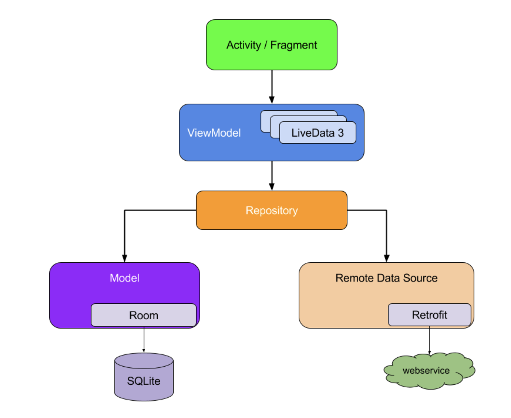

# Sarabjeet-Singh-DH-5F089053D76C7-5f0ab6c12c14f
DH-Interview Task Repository for: Sarabjeet Singh

## This Project consists of
* **Dagger** for dependency injection
* **Retrofit** and **RxJava2** for handling network and asyscronous tasks
* **Room** ORM for offline support
* **Kotlin Serialization** for deserializing and serializing json to pojo classes
* **Glide** for image loading
* **Data Binding** for Binding UI to ViewModels
* This Project follows single Activity Architecture with two Fragments 
consisting of **HomeFragmnet** and **DetailsFragment**
* The App also handles the deeplink **dhtech://restaurant/{restaurantId}**
for eg dhtech://restaurant/1001
* I have written Unit Tests for **HomeViewModel**, **ConfigManager**, **RestaurantItemViewModel**, **DeliveryHeroAPI**
which will give you the general idea about my testing, I wasnt able to cover all the code because of the time constraint, 
so I tried covering different type of classes

# MVVM Architecture used

